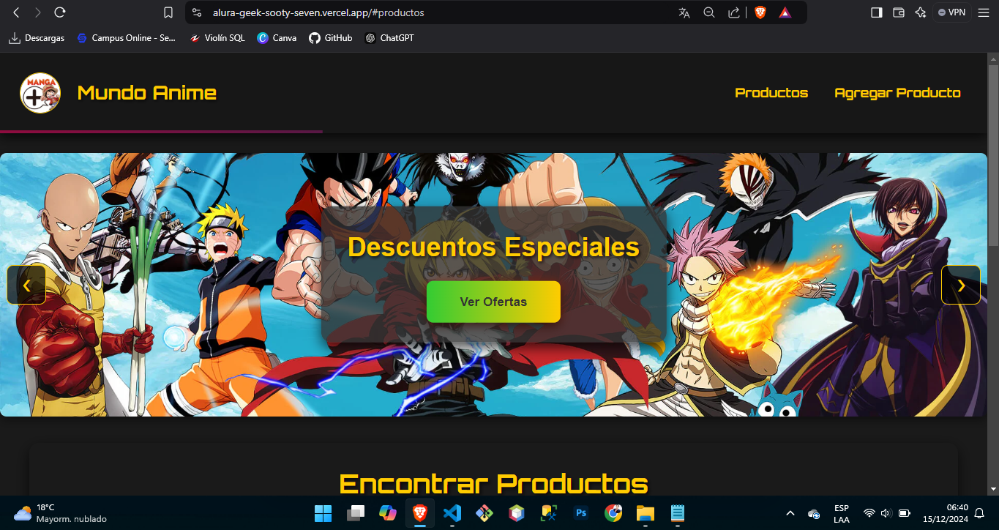
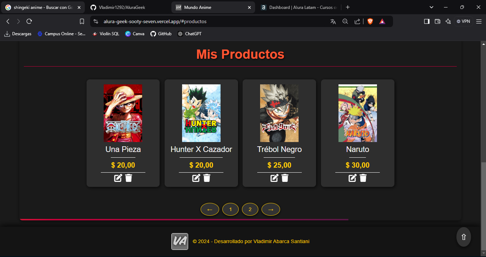
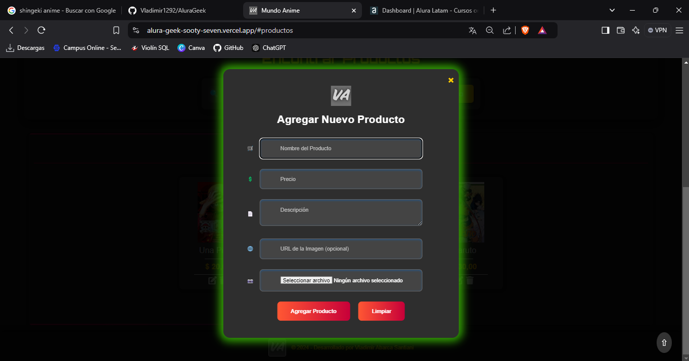

📝 Descripción del Proyecto
Challenge Alura Geek es una aplicación web que permite gestionar un inventario de productos mediante funciones completas de CRUD (Crear, Leer, Actualizar y Eliminar). 
El objetivo es proporcionar un catálogo funcional que permita a los usuarios administrar productos de manera intuitiva.

🚀 Estado del Proyecto
✅ Finalizado – Funcionalidades implementadas:

